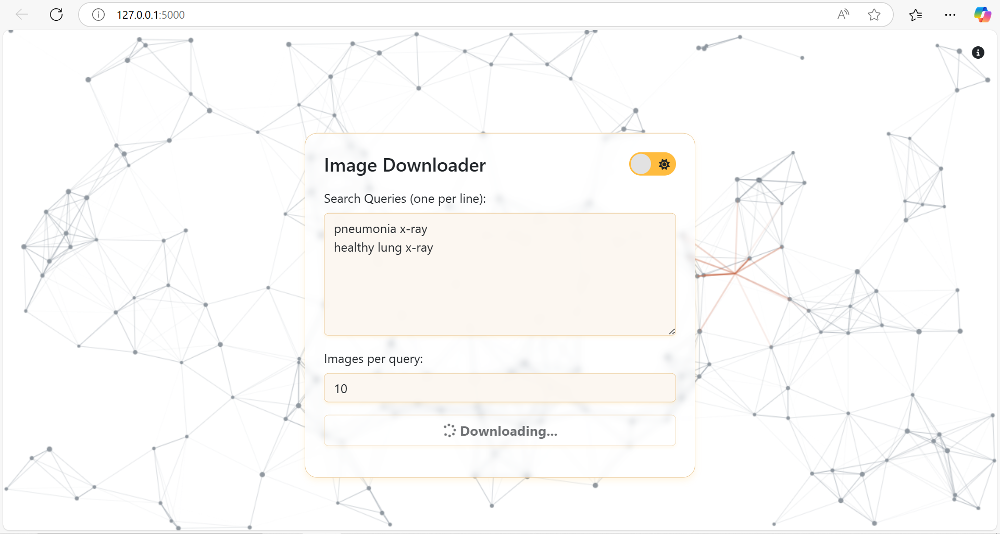
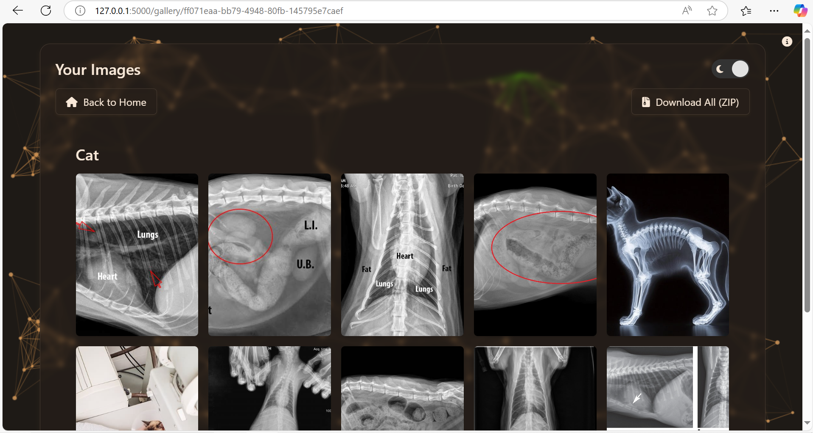

# 🖼️ Flask Image Downloader App

A responsive Flask web app that allows users to search, preview, and download images grouped by categories, complete with animated visuals and automatic cleanup features.

---

## 🚀 Features

- 🔍 Search for images by keyword (supports multiple queries)
- 🖼️ Categorized image preview with zoom hover effect
- 📦 One-click ZIP download of all images
- ♻️ Auto deletes old folders & ZIPs every 20 minutes
- 🌗 Light/dark theme toggle with local storage memory
- 🕸️ Spider-particle animated background
- 📱 Fully responsive layout using Bootstrap 5

---

## 📦 Installation

```bash
git clone https://github.com/yourusername/flask-image-downloader.git
cd flask-image-downloader

# Create a virtual environment
python -m venv venv
source venv/bin/activate  # or .\venv\Scripts\activate on Windows

# Install dependencies
pip install -r requirements.txt

# Run the app
python app.py
```
Then open http://localhost:5000 in your browser.
---
## 📂 Project Structure
```
├── app.py                # Main Flask app
├── downloadImage.py      # Image download & rename logic
├── Template/             # HTML templates
│   ├── base.html
│   ├── index.html
│   ├── gallery.html
│   ├── cleanup.html
│   ├── header.html
│   └── footer.html
├── static/               # Styles, scripts, images, downloaded files
│   ├── image/
│   ├── downloads/
│   ├── zips/
│   └── style.css
├── requirements.txt      # Python dependencies
├── README.md             # Project guide (this file)
├── LICENSE               # MIT license
└── .gitattributes        # Normalize line endings for Git
```
---
## 📸 Screenshots
| Home View | Gallery View | 
|----------------|--------------|
|  |  |

---
## 🧹 Auto Cleanup
Every 20 minutes, the app will automatically delete old downloaded folders and ZIP files (older than 20 minutes). This is handled via APScheduler and the /cleanup route shows the log report.
---
## 🧰 Built With
- Flask

- icrawler

- Bootstrap 5

- Font Awesome

- APScheduler

- JavaScript / jQuery

- Custom canvas animation
---
## 📜 License
This project is licensed under the MIT License.
See the [LICENSE](LICENSE) file for full details.
---
## 👤 Author
**Sanjay Kumar**
[Linkedin](https://www.linkedin.com/in/gotsanjay) - [GitHub](https://github.com/got-sanjay)
---
> Created with ❤️ by [Sanjaykumar](https://www.linkedin.com/in/gotsanjay)